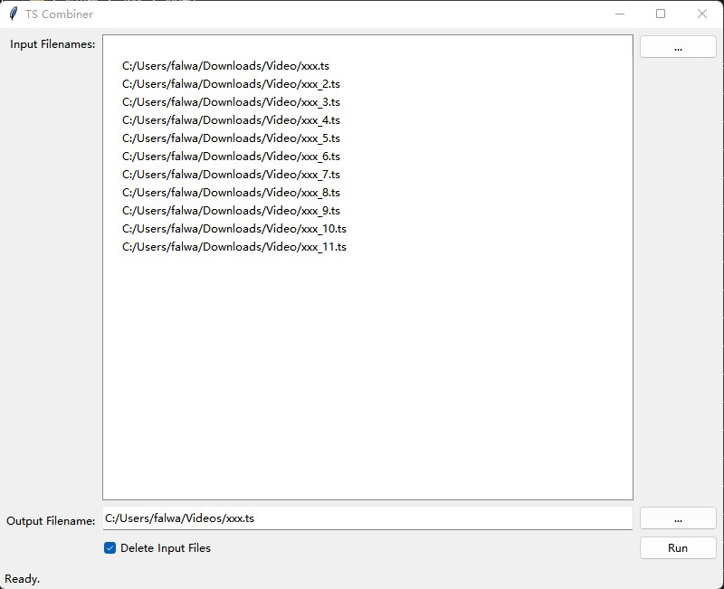

# ts_combiner

This python script tool is used to Combine multiple TS files into a single TS file.




## How to use

- Run the following command:

```shell
python ts_combiner.py
```

- select input files;
- select output file;
- check "Delete Input Files", if you need;
- click button "Run".
